# Architektur & Codefluss erklärt

Eine anschauliche Erklärung der wichtigsten Schritte im ENTSO-E Stromdaten-Tool.

---

## 🔄 Überblick: Wie die Daten fließen

```mermaid
graph LR
    A["📊 ENTSO-E API<br/>(Primärquelle)"] -->|fetch_entsoe_generation| B["🐍 entsoe_data_fetcher.py<br/>(Daten abholen)"]
    
    B -->|DataFrame| E["🔀 unified_data_pipeline.py<br/>(Vereinheitlichung)"]
    
    E -->|Normalisierte Daten| F["🚀 backend_api.py<br/>(FastAPI REST-Endpunkte)"]
    
    F -->|JSON über HTTP| G["⚛️ Frontend (React)<br/>(App.jsx)"]
    G -->|Browser-Visualisierung| H["📈 Dashboard<br/>(Charts, KPIs)"]
```



---

## 1️⃣ Schritt 1: Daten von ENTSO-E abholen

### 📝 Datei: `entsoe_data_fetcher.py`

**Aufgabe:** ENTSO-E-API aufrufen und Stromdaten abrufen.

#### Der wichtigste Prozess:

```python
def fetch_entsoe_generation(
    bidding_zone: str,            # z. B. "10Y1001A1001A63L" für Deutschland
    start: datetime,              # Startzeitpunkt
    end: datetime,                # Endzeitpunkt
    security_token: str           # ENTSO-E API-Key
) -> pd.DataFrame:
    # 1. Request-Parameter zusammenbauen
    params = {
        "documentType": "A75",           # A75 = Erzeugungsdaten
        "processType": "A16",            # A16 = Aktueller Prozess
        "in_Domain": bidding_zone,       # Für welches Land?
        "periodStart": build_period(start),   # Format: "202606250000"
        "periodEnd": build_period(end),
    }
    
    # 2. HTTP-Request an ENTSO-E senden (mit Authentifizierung)
    xml_response = _request_entsoe(params, security_token)
    
    # 3. XML parsen und in DataFrame umwandeln
    df = _parse_entsoe_xml(xml_response, bidding_zone, "generation", use_psr_type=True)
    
    return df  # DataFrame mit Spalten: [timestamp, zone, metric, value, source]
```

#### Was passiert beim XML-Parsen?

```python
def _parse_entsoe_xml(xml_text: str, ...) -> pd.DataFrame:
    root = ET.fromstring(xml_text)  # XML laden
    rows = []
    
    # Über jede TimeSeries iterieren (= Energiequelle wie Solar, Wind, etc.)
    for series in root.iter():
        if clean_tag(series.tag) != "TimeSeries":
            continue
        
        # Energietyp auslesen (z. B. "B16" = Solar, "B18" = Wind)
        psr_type = _find_child(series, "MktPSRType/psrType")
        
        # Alle Zeitpunkte und Werte dieser Quelle auslesen
        for point in period.iter():
            value = extract_value(point)
            timestamp = calculate_timestamp(...)
            rows.append({
                "timestamp": timestamp,
                "metric": psr_type,  # z. B. "B16"
                "value": value,
                "source": "ENTSO-E"
            })
    
    return pd.DataFrame(rows)  # → [Solar, Wind, Wasser, ... im 15-min-Takt]
```

---


---

## 2️⃣ Schritt 2: Daten vereinheitlichen

### 📝 Datei: `unified_data_pipeline.py`

**Aufgabe:** ENTSO-E-Daten in ein gemeinsames Format bringen.

```python
def normalize_df(
    df: pd.DataFrame, 
    metric: str,           # z. B. "generation"
    source: str,           # z. B. "ENTSO-E"
    zone: str,
    unit: str              # z. B. "MW"
) -> pd.DataFrame:
    
    # 1. Verschiedene Zeitspalten-Namen vereinheitlichen
    if "timestamp" not in df.columns:
        if "time" in df.columns:
            df["timestamp"] = df["time"]
        elif "from" in df.columns:
            df["timestamp"] = df["from"]
    
    # 2. Verschiedene Wert-Spalten-Namen vereinheitlichen
    if "value" not in df.columns:
        for candidate in ["measurementValue", "quantity", "valueAmount"]:
            if candidate in df.columns:
                df["value"] = df[candidate]
    
    # 3. Zeitstempel normalisieren (UTC)
    df["timestamp"] = pd.to_datetime(df["timestamp"], utc=True)
    
    # 4. Werte numerisch machen
    df["value"] = pd.to_numeric(df["value"], errors="coerce")
    
    # 5. Metadaten hinzufügen
    df["metric"] = metric
    df["source"] = source
    df["unit"] = unit
    
    return df[["timestamp", "zone", "metric", "value", "source", "unit"]]
```

**Ergebnis:** Alle Daten folgen diesem Schema:
```
timestamp           zone   metric           value   source   unit
2026-06-25 10:00   DE     generation       1500    ENTSO-E  MW
```

---

## 3️⃣ Schritt 3: REST-API bereitstellen

### 📝 Datei: `backend_api.py`

**Aufgabe:** Daten über HTTP-Endpunkte für das Frontend verfügbar machen.

#### Setup und Sicherheit:

```python
# 1. FastAPI-App erstellen
app = FastAPI(
    title="ENTSO-E Energy Data API",
    version="0.3.0",
)

# 2. CORS aktivieren (Frontend darf vom anderen Port zugreifen)
app.add_middleware(CORSMiddleware, allow_origins=["*"])

# 3. Rate-Limiting hinzufügen (pro IP-Adresse)
limiter = Limiter(key_func=get_remote_address)
app.add_middleware(SlowAPIMiddleware)

# 4. Optional: API-Key-Schutz
def verify_backend_api_key(x_api_key: Optional[str] = Header(None)):
    backend_key = os.getenv("BACKEND_API_KEY")  # Aus .env laden
    if backend_key and x_api_key != backend_key:
        raise HTTPException(status_code=401, detail="Ungültiger Backend-API-Key")
```

#### Endpunkte (Beispiele):

```python
@app.get("/entsoe/generation")
@limiter.limit("5/minute")  # Max. 5 Anfragen pro Minute
def entsoe_generation(
    request: Request,
    zone: str = Query("10Y1001A1001A63L"),  # Deutschland
    start: Optional[str] = Query(None),     # z. B. "2026-06-25T00:00:00"
    end: Optional[str] = Query(None),
    _api_key_valid: None = Depends(verify_backend_api_key)  # ← Authentifizierung
):
    """
    Erzeugungsdaten von ENTSO-E abrufen.
    
    Beispiel:
    GET /entsoe/generation?zone=10Y1001A1001A63L&start=2026-06-25T00:00:00&end=2026-06-25T01:00:00
    """
    
    # 1. Zeitbereich validieren
    start_ts, end_ts = make_time_range(start, end)
    
    # 2. API-Key aus Umgebung auslesen
    token = os.getenv("ENTSOE_API_KEY")
    if not token:
        raise RuntimeError("ENTSOE_API_KEY ist nicht gesetzt.")
    
    # 3. Daten von ENTSO-E abrufen
    df = entsoe_fetcher.fetch_entsoe_generation(zone, start_ts, end_ts, token)
    
    # 4. Als JSON zurückgeben
    return df.to_dict(orient="records")
```

**Rückgabeformat (JSON):**
```json
[
  {
    "timestamp": "2026-06-25T10:00:00+00:00",
    "zone": "10Y1001A1001A63L",
    "metric": "B16",
    "value": 1234.5,
    "source": "ENTSO-E"
  },
  {
    "timestamp": "2026-06-25T10:00:00+00:00",
    "zone": "10Y1001A1001A63L",
    "metric": "B18",
    "value": 5678.9,
    "source": "ENTSO-E"
  }
]
```

---

## 4️⃣ Schritt 4: Frontend lädt und zeigt Daten

### 📝 Datei: `frontend/src/App.jsx`

**Aufgabe:** Daten vom Backend abrufen und im Browser visualisieren.

```javascript
const App = () => {
  // 1. State für Konfiguration
  const [backendUrl, setBackendUrl] = useState('http://localhost:8000');
  const [selectedZone, setSelectedZone] = useState('10Y1001A1001A83F');  // Deutschland
  const [startDate, setStartDate] = useState('2026-06-25T00:00');
  const [endDate, setEndDate] = useState('2026-06-25T23:59');
  const [data, setData] = useState([]);
  
  // 2. Daten vom Backend abrufen (bei Button-Click)
  const handleLoadData = async () => {
    try {
      // HTTP-Request an Backend
      const url = new URL(`${backendUrl}/entsoe/generation`);
      url.searchParams.append('zone', selectedZone);
      url.searchParams.append('start', startDate);
      url.searchParams.append('end', endDate);
      
      const response = await fetch(url.toString());
      const jsonData = await response.json();
      
      // 3. Daten speichern
      setData(jsonData);
      
    } catch (error) {
      console.error('Fehler beim Laden:', error);
    }
  };
  
  // 4. Daten visualisieren (Plotly Chart)
  return (
    <div>
      <h1>EU-Stromdaten Dashboard</h1>
      
      {/* Input-Felder für Konfiguration */}
      <input 
        type="text" 
        placeholder="Backend URL"
        value={backendUrl}
        onChange={(e) => setBackendUrl(e.target.value)}
      />
      
      <select value={selectedZone} onChange={(e) => setSelectedZone(e.target.value)}>
        {AVAILABLE_COUNTRIES.map(c => (
          <option key={c.zone} value={c.zone}>{c.label}</option>
        ))}
      </select>
      
      <input 
        type="datetime-local"
        value={startDate}
        onChange={(e) => setStartDate(e.target.value)}
      />
      
      <button onClick={handleLoadData}>Daten laden</button>
      
      {/* Chart-Anzeige */}
      {data.length > 0 && (
        <EnergyChart data={data} />
      )}
    </div>
  );
};
```

#### Chart-Komponente (Plotly):

```javascript
const EnergyChart = ({ data }) => {
  // 1. Daten nach Energietyp gruppieren
  const groupedData = {};
  data.forEach(row => {
    if (!groupedData[row.metric]) {
      groupedData[row.metric] = [];
    }
    groupedData[row.metric].push({
      timestamp: new Date(row.timestamp),
      value: row.value
    });
  });
  
  // 2. Für jeden Energietyp ein Trace (Linie) erstellen
  const traces = Object.entries(groupedData).map(([metric, points]) => ({
    x: points.map(p => p.timestamp),
    y: points.map(p => p.value),
    mode: 'lines',
    name: GENERATION_TECHNOLOGY_LABELS[metric] || metric,  // z. B. "Solar", "Wind"
    fill: 'tonexty',  // Fläche unter der Linie ausfüllen (Stacked)
  }));
  
  // 3. Plotly-Chart rendern
  return (
    <Plot
      data={traces}
      layout={{
        title: 'Erzeugungsmix über Zeit',
        xaxis: { title: 'Zeitpunkt' },
        yaxis: { title: 'Leistung [MW]' },
        hovermode: 'x unified'
      }}
    />
  );
};
```

**Visuelles Ergebnis im Browser:**
```
┌─────────────────────────────────┐
│ Erzeugungsmix 25.06.2026       │
├─────────────────────────────────┤
│         ╱╲                      │  ← Solar (rot oben)
│        ╱  ╲    ╱╲              │
│  ════╱╱═════╲╱══╲════════════  │  ← Wind (blau)
│  ═════════════════════════════  │  ← Kernkraft (grün unten)
│  0:00 6:00 12:00 18:00 24:00   │
└─────────────────────────────────┘
```

---

## 📊 Konkrete Abläufe

### Beispiel A: Dashboard startet

```
Benutzer öffnet http://localhost:5173 im Browser
         ↓
Frontend lädt aus Browser-Storage: 
  - Letzte Backend-URL
  - Letzte Zone (z. B. Deutschland)
  - Letzte Zeitrange
         ↓
Frontend auto-refresh (alle 5 Minuten):
  HTTP GET http://localhost:8000/entsoe/generation
            ?zone=10Y1001A1001A63F
            &start=2026-06-25T00:00:00
            &end=2026-06-25T23:59:59
         ↓
Backend backend_api.py empfängt Request
  1. Authentifizierung prüfen (falls BACKEND_API_KEY gesetzt)
  2. Rate-Limit prüfen (max. 5 Anfragen/Minute)
  3. Zeitbereich validieren
  4. entsoe_fetcher.fetch_entsoe_generation() aufrufen
         ↓
entsoe_data_fetcher.py:
  1. HTTP GET an https://web-api.tp.entsoe.eu/api
     + Parameter: zone, start, end, securityToken
  2. XML-Response parsen
  3. In DataFrame umwandeln
  4. Zurück an backend_api.py
         ↓
Backend:
  1. DataFrame zu JSON wandeln
  2. HTTP 200 mit JSON zurückgeben
         ↓
Frontend:
  1. JSON-Daten empfangen
  2. Im Browser-State speichern
  3. Plotly-Chart zeichnen (Stacked Area mit Solar, Wind, etc.)
         ↓
Benutzer sieht interaktives Chart im Browser ✅
```


---

## 🔑 Wichtigste Dateien und ihre Rollen

| Datei | Aufgabe | Input | Output |
|-------|---------|-------|--------|
| `entsoe_data_fetcher.py` | ENTSO-E-API aufrufen | Zeitbereich, Zone, Token | DataFrame (15-min Auflösung) |
| `unified_data_pipeline.py` | Daten normalisieren | DataFrames von verschiedenen Quellen | Einheitlicher DataFrame |
| `backend_api.py` | REST-API bereitstellen | HTTP-Requests vom Frontend | JSON-Response |
| `daily_data_sync.py` | Täglicher automatischer Abruf | (keine) | CSV-Export der Daten |
| `App.jsx` | Benutzeroberfläche | Backend-URL, Zone, Zeitbereich | Interaktives Dashboard |

---

## 🚀 Zusammenfassung des Datenflusses

```
1. User gibt Zeitbereich + Land ein (Frontend)
                    ↓
2. Frontend sendet HTTP-Request an Backend (/entsoe/generation)
                    ↓
3. Backend ruft entsoe_fetcher auf → ENTSO-E-API
                    ↓
4. Daten kommen als XML zurück → XML wird zu DataFrame geparst
                    ↓
5. Backend gibt DataFrame als JSON zurück
                    ↓
6. Frontend empfängt JSON und zeichnet Plotly-Chart
                    ↓
7. User sieht interaktives Stacked-Area-Chart mit Solar/Wind/Kernkraft/etc.
```

Das ist die Kernlogik des Tools: **Externe Stromdaten → Python-Verarbeitung → REST-API → Frontend-Visualisierung**.
